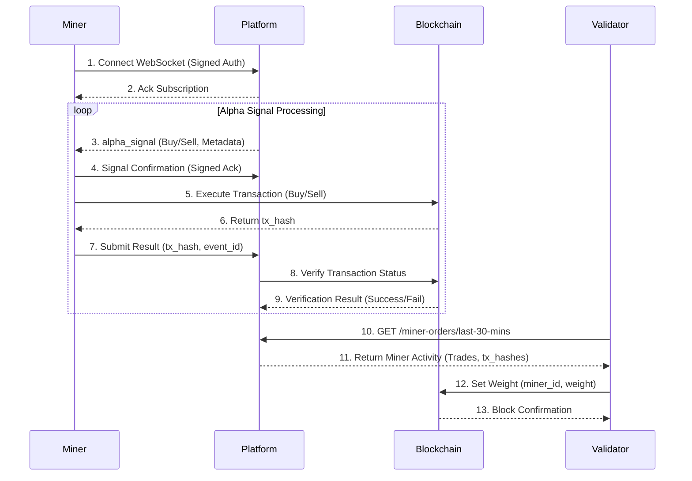

# τensorUSD
A reserve-backed stablecoin designed to support 1:1 redeemability for US Dollar within the Bittensor ecosystem.

## Architecture

**Miner flow**
1. Connect to the subnet gateway (WebSocket).
2. Receive an order assignment.
3. Validate balance and per-order limits (`MAX_BUY_LIMIT`, `MAX_SELL_LIMIT`).
4. Sign and send an ACK back to the gateway.
5. Execute the on-chain swap and submit completion data.

**Validator flow**
1. Fetch miner performances from the gateway/API.
2. Analyze completions.
3. Compute miner scores (EMA).
4. Set weights.
